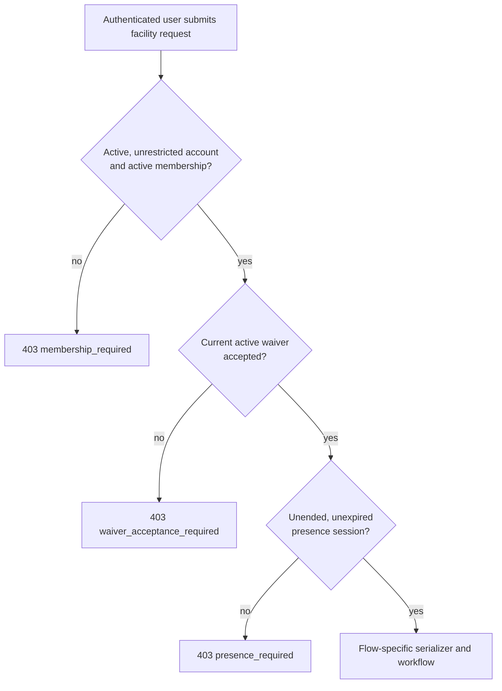
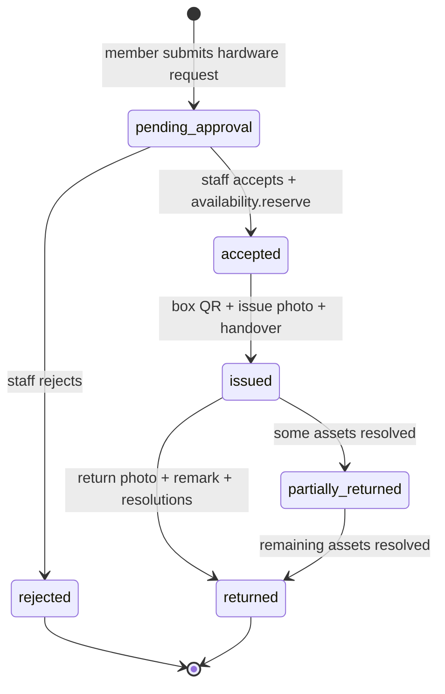
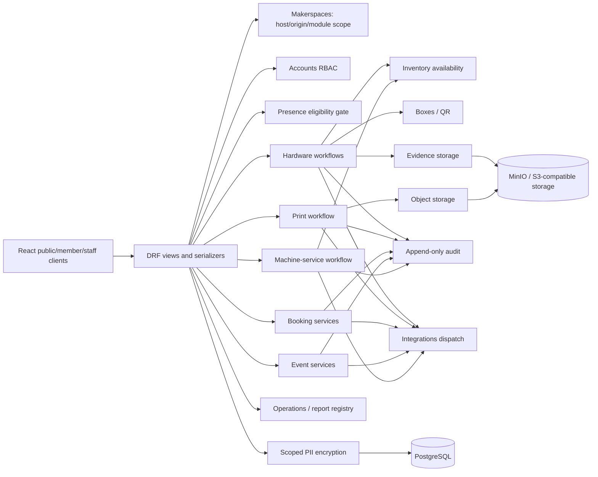

# Architecture

## 1. System overview

OSMM is a multi-tenant makerspace platform for public discovery and staff operation of
hardware lending, QR/box custody, self-checkout, 3D printing, bookable spaces, events,
machines, maintenance, procurement, and machine-service requests. Its central design
concern is a traceable physical handover: staff actions are backed by QR scans, evidence
photos, remarks, immutable records, and an append-only audit trail.

The browser clients are deliberately thin. React owns routes, forms, cached server state,
and presentation; Django/DRF owns tenancy resolution, authorization, invariants, workflow
transitions, quantity accounting, storage finalization, notifications, and audit entries.
For example, the public hardware view only checks eligibility and calls the request workflow;
`submit_request()` creates the request, writes the audit event, and emits notifications
(`backend/apps/hardware_requests/public_views.py:51`,
`backend/apps/hardware_requests/request_workflow.py:17`).

The operational posture is self-host first:

- Default local infrastructure is PostgreSQL 16 and MinIO, with optional Redis/Celery.
- Managed/SaaS behavior is env-gated and dormant by default: managed Postgres purge handling,
  PUT presigning for Supabase-compatible storage, connection-pool settings, hosted-domain
  verification, and fair-use limits. `MANAGED_POSTGRES` defaults to false and
  `STORAGE_PRESIGN_METHOD` to `post` (`backend/config/settings.py:53-75`).
- Per-makerspace PII encryption is also dormant unless explicitly enabled; disabled installs do
  not require key material (`backend/config/settings.py:373-385`).

## 2. Topology and tenancy

`Makerspace` is the tenant root. Nearly every domain record carries a makerspace directly or
through its parent (for example, print requests through a print bucket). A makerspace controls
module flags, branding, public API key, domain/origin setup, archive state, and resource policy
(`backend/apps/makerspaces/models.py:99-278`).

### Tenant addressing and boundaries

- The central frontend uses `/m/:slug/...`; a single-tenant frontend uses the same public
  routes at its domain root. `TenantProvider` bootstraps either from configured tenant token or
  from request Origin/Host (`frontend/src/lib/tenant.tsx:45-106`), and `App.tsx` installs both
  route families (`frontend/src/App.tsx:307-347`).
- `frontend_domain` is normalized to a bare host and has a case-insensitive unique constraint,
  enforcing one frontend domain per makerspace (`backend/apps/makerspaces/models.py:32-40`,
  `backend/apps/makerspaces/models.py:225-246`). Verified domains feed host validation, CORS,
  origin scope, and public/staff frontend resolution.
- Origin scope is an additional staff-side tenancy fence: it derives the current domain's
  makerspace and rejects cross-tenant targets even where a user otherwise has access
  (`backend/apps/makerspaces/origin_scope.py:39-122`). Normal staff querysets must also use
  action-scoped RBAC, described below.
- A tenant can be hidden from the central directory. `superadmin_access_enabled=False` is a
  hard block on global superadmin powers; only an explicit active membership with the required
  action can see or operate that tenant (`backend/apps/accounts/rbac.py:295-358`).
- Archive is a soft operational removal (`archived_at` is the source of truth); only archived,
  superadmin-visible tenants can be permanently purged. Purge clears the object graph and
  storage keys under an explicit immutable-delete escape hatch
  (`backend/apps/makerspaces/models.py:203-208`, `backend/apps/makerspaces/lifecycle.py:44-66`,
  `backend/apps/makerspaces/lifecycle.py:197-264`).

### Surfaces

| Surface | Audience and responsibility |
| --- | --- |
| Public React app | Discovery, catalog, member self-service, and public forms under `/` or `/m/:slug`. |
| React staff console | Action-authorized operational UI at `/admin` and `/guest-admin`; it never becomes the Django control plane. |
| Django `/control/` | Superadmin-only Django admin for platform control, archival, and guarded purge. It is deliberately not proxied through the public frontend nginx (`backend/config/urls.py:47-50`, `frontend/nginx.conf:28-30`). |
| DRF API | Versioned API under `/api/v1/`, OpenAPI at `/schema/`, and Swagger/ReDoc at `/docs/` and `/redoc/` (`backend/config/urls.py:35-83`). |

## 3. Identity, authentication, and RBAC

### Global accounts and tokens

`accounts.User` is global, not tenant-local. It extends Django's user with display/contact
fields, a global role used principally for superadmin, active/restricted status, and retained
legacy Check-In identity fields (`backend/apps/accounts/models.py:10-78`). DRF defaults to JWT
authentication and deny-by-default permissions (`backend/config/settings.py:389-399`). Login
returns a short-lived access JWT while refresh is held in an HTTP-only cookie; refresh/logout
implement rotation/blacklisting and CSRF/origin checks (`backend/apps/accounts/views.py:94-251`,
`backend/apps/accounts/auth_cookies.py:9-52`). The React client stores the access token only in
memory and refreshes it on eligible 401s (`frontend/src/lib/api.ts:8-13`,
`frontend/src/lib/api.ts:236-262`).

### Roles are action-based and tenant-scoped

`MakerspaceMembership` connects a global user to one makerspace. It has a legacy role column
and an optional `MakerspaceRole` with `granted_actions`; the custom role must belong to the same
tenant and memberships cannot be assigned to inactive users
(`backend/apps/makerspaces/models.py:280-383`). The Member role is protected rather than a
staff privilege. `MakerspaceRole` stores a per-tenant action set with uniqueness and protected/
default-role constraints (`backend/apps/makerspaces/models.py:386-438`).

RBAC performs a dual read while legacy roles remain: `actions_for_membership()` resolves an
assigned role first and falls back to the legacy role mapping; `scope_by_action()` constrains a
queryset, while `can()` authorizes an action (`backend/apps/accounts/rbac.py:109-247`). This is
the required route for staff domain queries and prevents cross-tenant leakage. The staff UI
mirrors these capabilities via `staffAccess`, which gates tabs from the current membership's
actions (`frontend/src/features/staff/staffAccess.ts:1-103`).

### Member layer (M1–M3)

1. **Global registration and verification (M1).** `POST /auth/member-sign-up` creates the
   global account and issues an email OTP; resend and confirmation are separate throttled
   endpoints (`backend/apps/accounts/urls.py:18-28`,
   `backend/apps/accounts/services_registration.py:48-170`).
2. **Membership and waiver (M2).** An authenticated user requests a membership in a public
   tenant; staff can invite, approve, revoke, and assign roles. Membership requests and active
   waiver versions are tenant objects with uniqueness constraints. A membership records exactly
   one all-or-nothing accepted waiver/version/timestamp set
   (`backend/apps/makerspaces/membership_services.py:35-196`,
   `backend/apps/makerspaces/models.py:335-354`,
   `backend/apps/makerspaces/waiver_services.py:11-53`).
3. **Presence (M3).** A presence session is a time-boxed declaration associated with the member
   and active membership; it expires by time rather than a cron mutation. Starting a different
   duration supersedes active sessions, and membership revocation ends them
   (`backend/apps/presence/models.py:9-46`, `backend/apps/presence/services.py:22-81`).

## 4. Facility eligibility gate and Check-In retirement

`require_active_member_presence(user, makerspace)` is the reusable eligibility contract for a
facility submission. It returns membership, current waiver, and live presence session on success
(`backend/apps/presence/guard.py:25-60`). On failure, the shared DRF exception handler produces
stable 403 response codes:

| Condition | Code | Meaning |
| --- | --- | --- |
| Unauthenticated, inactive/restricted user, or no active membership | `membership_required` | A current member account is required. |
| Active waiver does not match the membership's accepted version | `waiver_acceptance_required` | The member must accept the current waiver. |
| No unended, unexpired presence session | `presence_required` | The member must start presence. |

These codes are centralized in `backend/apps/hardware_requests/exceptions.py:50-65`, so every
caller has the same client contract.

The public *submission* routes now call the gate before their domain service:

- hardware request: `backend/apps/hardware_requests/public_views.py:27-51`;
- self-checkout/return/problem report: `backend/apps/hardware_requests/self_checkout_views.py:24-131`;
- print presign/submit: `backend/apps/printing/public_views.py:14-122`;
- booking submission: `backend/apps/bookings/views_public.py:21-145`;
- event registration: `backend/apps/events/views_public.py:22-101`;
- machine-service submission: `backend/apps/machines/views_public_service.py:21-48`.



Check-In is retired as a runtime integration: `apps.checkin` is not installed
(`backend/config/settings.py:78-116`), no Check-In routes are present in the URL configuration,
and the M7 test asserts the removed import surface and routes
(`backend/tests/accounts/test_checkin_retirement_m7.py:17-36`). Historical columns such as
`User.external_checkin_user_id` and `PrintRequestFile.owner_checkin_user_id` remain read-only
legacy data to keep old records and staff labels interpretable; they are not populated by the
member flows (`backend/apps/accounts/models.py:25-45`,
`backend/tests/accounts/test_checkin_retirement_m7.py:38-73`).

## 5. Core domain modules

### Runtime backend app map

The runtime backend consists of 23 source apps (not `checkin`):

- **Platform and access:** `accounts` (users, auth, RBAC), `makerspaces` (tenant root,
  memberships, roles, waivers, domains, lifecycle), `presence` (sessions/gate), `admin_api`
  (React-staff API composition), and `apiclients` (signed external clients).
- **Physical inventory:** `inventory`, `boxes`, `hardware_requests`, `evidence`, `audit`, and
  `operations` (ledger, stocktake/transfer, reports, QR batches).
- **Fabrication and facilities:** `printing`, `machines` (including machine service),
  `maintenance`, `bookings`, `events`, `procurement`, and `warranty`.
- **Shared/product support:** `integrations`, `notifications`, `encryption`, `forms_schema`, and
  `roadmap`.

Each app's migrations are colocated in its `migrations/` directory. Relevant recent leaves include
`accounts/0006`, `makerspaces/0041-0044`, `presence/0001`, `hardware_requests/0023`,
`printing/0021`, `bookings/0006`, `events/0006`, and `machines/0010`; their leaf names make the
M/N additions visible without treating migration names as runtime behavior.

### Inventory, custody, evidence, and audit

- **Inventory** models catalog products and optionally serialized individual assets. Only
  `apps.inventory.availability` moves quantity buckets: it locks rows, requires an atomic
  transaction for mutations, and rejects insufficient stock. It owns reservation, issue, return,
  stocktake, transfer, triage, repair, and scrap accounting
  (`backend/apps/inventory/availability.py:53-81`,
  `backend/apps/inventory/availability.py:364-575`).
- **Boxes and QR** bind physical containers/assets to QR codes and append scan evidence. BoxScan
  and QrScanEvent reject model update/delete and migrations add database immutability triggers
  (`backend/apps/boxes/models.py:69-110`, `backend/apps/boxes/models.py:160-213`).
- **Evidence** creates presigned staged objects, finalizes and validates them under workflow row
  locks, then retains immutable `EvidencePhoto` records. Model guards and DB triggers defend
  immutability (`backend/apps/evidence/models.py:5-34`,
  `backend/apps/hardware_requests/handover_workflow.py:102-184`).
- **Audit** is a cross-domain append-only event log. `audit.services.record()` is the common
  writer, and migrations enforce append-only and purge-aware delete triggers
  (`backend/apps/audit/services.py:6-25`, `backend/apps/audit/migrations/0002_auditlog_append_only_triggers.py`).

### Lifecycle authorities

Views validate input and permissions; they do not implement transitions. The following modules
are the transition/side-effect authorities, using transactions and audit records.

| Domain | Authority and lifecycle |
| --- | --- |
| Hardware requests | `hardware_requests.workflow` is a thin export barrel for submission/review, box handover, and return authorities (`backend/apps/hardware_requests/workflow.py:1-37`). State: `pending_approval → accepted → issued → partially_returned → returned`, with rejection from pending (`backend/apps/hardware_requests/models.py:8-36`). Hardware issue requires an assigned box and finalized issue evidence; returns require evidence and remarks. |
| Self checkout | `self_checkout_workflow` creates/returns a QR-bound `PublicToolLoan`, changes the underlying request, asset state, and audit trail atomically (`backend/apps/hardware_requests/self_checkout_workflow.py:41-162`). |
| Printing | `printing.workflow` owns `pending → accepted → printing → completed → collected`, plus rejected/failed and controlled reprint. It reconciles filament and notifies after state changes (`backend/apps/printing/workflow.py:18-23`, `backend/apps/printing/workflow.py:33-277`). |
| Space bookings | `services_bookings` owns pending/confirmed/rejected and the confirmed terminal transitions (cancelled/completed/no-show), including locked overlap checks and lifecycle notifications (`backend/apps/bookings/services_bookings.py:51-235`). |
| Events | `events.services` owns draft/published/cancelled/completed event transitions, capacity/waitlist promotion, registration cancellation, and attendance (`backend/apps/events/services.py:58-242`). |
| Machine service | `machines.service_workflow` is explicitly the sole transition authority. It gates the module and machine availability, tracks pending/accepted/in-progress/completed-or-failed/collected, debits consumptions, writes audit events, and sends notifications after commit (`backend/apps/machines/service_workflow.py:1-44`, `backend/apps/machines/service_workflow.py:72-287`). |
| Machines, maintenance, procurement, roadmap | Machines hold types, operators, usage, documents, errors, and consumables; maintenance holds schedules/logs/documents; procurement covers to-buy items and receipts; roadmap provides public roadmap items. Their staff APIs are concentrated in `admin_api`, with makerspace/action scoping. |



## 6. Module dependencies



## 7. Cross-cutting infrastructure and invariants

### Integrations and operations

`integrations.notify` is the feature-event fan-out choke point. It applies notification rules,
mutes, quotas, and delivery logs before dispatching email or non-email channels; async work goes
through Celery when configured (`backend/apps/integrations/notify.py:49-155`,
`backend/apps/integrations/dispatch.py:25-199`,
`backend/apps/integrations/dispatch_channels.py:62-161`). The supported configured channels are
email plus Telegram, Slack, and Mattermost. Makerspace integration secrets are encrypted at rest
and serializers expose only write-only values with `*_set` indicators.

`operations` is the reporting and physical-operations layer: containers, QR batches, stock
transfers, stocktakes, ledger/accountability, dashboard, and report export. Its explicit report
registry maps report key to builder, fields, required modules, and exportability
(`backend/apps/operations/report_registry.py:8-79`). Aggregate endpoints are superadmin-only;
tenant reports retain makerspace scope rather than flattening data across tenants
(`backend/apps/operations/views_reports.py:80-189`).

### Scoped PII

The PII subsystem maps only declared fields in domain models, encrypts values with a per-
makerspace DEK, binds ciphertext to makerspace/table/row/field as AAD, and supports local or AWS
KMS brokers (`backend/apps/encryption/registry.py:7-52`,
`backend/apps/encryption/crypto.py:52-135`, `backend/apps/encryption/services.py:36-133`).
Scoped model/queryset mappers prevent bypass writes; blind indexes enable scoped lookup; global
and per-makerspace write fences fail protected writes closed during sensitive operations
(`backend/apps/encryption/mappers.py:11-122`, `backend/apps/encryption/write_fence.py:17-118`).

### Invariants to preserve

- **Quantity:** only inventory availability changes quantity buckets; no bucket goes below zero.
- **Transition:** state changes go through each domain's authority, not direct `.status` writes.
- **Tenant:** staff reads are RBAC/action scoped and origin scoped; hidden/archived makerspaces
  are excluded even from global superadmin scope unless the explicit-membership exception applies.
- **Traceability:** issues need box scan + issue photo; returns need return photo + remark;
  audit/scan/evidence records are immutable outside the narrowly scoped purge path.
- **Storage:** keys are generated under makerspace-owned prefixes (for example evidence uses
  `evidence_object_key(makerspace_id, type)`), validated/finalized from staging, and owner-checked
  before use (`backend/apps/evidence/storage.py:53-173`). Public images use the distinct public
  bucket; sensitive evidence remains signed/private.
- **Deployment:** managed fair-use quotas cover products, assets, machines, members, storage,
  print, email/notification channels, API clients, and custom roles; `None` means unlimited in
  self-host mode (`backend/config/settings.py:54-73`, `backend/apps/makerspaces/limits.py:62-356`).
- **Parity:** staff actions are exposed through both the React operational console and the
  superadmin `/control/` control plane where appropriate, but neither is allowed to bypass the
  same RBAC/workflow/services layer.

## 8. Frontend architecture

`frontend/src` contains reusable `components`, `lib`, generated API metadata, and feature slices:

- `inventory`, `printing`, `bookings`, `roadmap`, and `stats` are public-facing slices;
- `members` is the member self-service portal; it restores the refresh session, requests/join
  status, waiver acceptance, presence start/end, and My Activity
  (`frontend/src/features/members/MemberArea.tsx:19-50`);
- `staff` is the large staff console, split into tabs/panels and domain API helpers (inventory,
  requests, printing, machines, events, bookings, members, reports, integrations, roles, and
  platform settings); and
- `forms` contains reusable custom form schema/editor/display components.

TanStack Query is the server-state mechanism: it wraps tenant bootstrap, lists, details, and
mutations; mutations invalidate keyed queries rather than maintain duplicate domain state. The
root installs `QueryClientProvider` and `BrowserRouter` (`frontend/src/main.tsx:3-26`).

The handwritten `lib/api.ts` covers auth refresh, tenant bootstrap, public publishable-key
requests, and staff requests; OpenAPI remains the contract snapshot in
`frontend/openapi-schema.json`. `npm run generate:api` reads that snapshot (or an explicit
schema URL) and writes the lightweight typed path/tag client at `src/generated/api.ts`
(`frontend/scripts/generate-api-client.mjs:3-75`).

## 9. End-to-end data flows

### Member borrow and return

1. A person registers globally, verifies the email OTP, and signs in.
2. They request membership in a makerspace; staff approves them with the protected Member role
   or another permitted role. They accept the current versioned waiver and start a preset
   presence session.
3. A borrow submission passes the eligibility gate and `submit_request()` creates a pending
   request. Staff accepts it, causing `availability.reserve_for_request()` to lock/reserve stock.
4. Staff assigns/scans the box and finalizes issue evidence; the handover workflow issues stock
   and audits both scan and issue. On return, staff submits required photo, remark, box scan, and
   resolutions; availability returns/triages assets and the immutable return event/audit record
   closes the handover.

### Public print submission

1. The public print page bootstraps the tenant and reads public printer/spool metadata.
2. The signed-in member passes membership, current-waiver, and presence checks before presigning
   and submitting the file/request.
3. The print workflow owns later staff transitions, printer assignment, filament reservation/
   reconciliation, payment state, notifications, and audit records. Tokenized public status is
   limited to the request's public token rather than requester history.

### Superadmin archive and purge

1. A superadmin archives a visible makerspace through the guarded lifecycle; scopes stop serving
   it operationally.
2. Purge requires archived state, visible superadmin access, and the explicit `/control/`
   confirmation path. The lifecycle collects object keys, enables the transaction-local immutable
   deletion exception suited to self-host or managed Postgres, deletes the graph, emits
   `makerspace.purge_started`/`makerspace.purged`, and attempts storage cleanup.

## 10. Build, test, and deployment

### Current stack

The repo currently specifies Django 6.0.x, DRF 3.17+, PostgreSQL 16, Django Unfold, SimpleJWT,
Celery/Redis, MinIO/S3-compatible storage, and React 19.2 + Vite 8.1 + TypeScript 6
(`backend/requirements.txt`, `docker-compose.yml`, `frontend/package.json`).

### Local workflow

```powershell
docker compose up -d db minio redis
cd backend
pip install -r requirements.txt
python manage.py migrate
python manage.py seed_demo
python manage.py runserver

cd ..\frontend
npm install
npm run dev
```

`docker compose up` additionally supplies `osmm-db`, MinIO bucket creation, Redis, migration,
backend, worker/beat, and nginx frontend services (`docker-compose.yml`). The backend pytest
configuration discovers `backend/tests/test_*.py`; tests use the Postgres-backed Django harness,
while integration behavior covers storage, presence, encryption, workflows, and tenant isolation
(`backend/pytest.ini:1-4`). Run the full gate with `cd backend && pytest`; build the frontend with
`npm run build`; regenerate API metadata with `npm run generate:api` after schema changes.

Every schema change is a Django migration in the owning app. Migrations carry database-enforced
constraints/triggers where model methods are insufficient (notably audit/evidence/QR
immutability). Do not hand-edit a migration that has been deployed; add a forward migration.

### CI and releases

The checked-in GitHub Actions release workflow publishes only when `VERSION` changes on `main`.
It validates semantic versioning, builds/pushes backend and frontend GHCR images with full/minor/
latest tags, then creates `vX.Y.Z` and a GitHub Release
(`.github/workflows/release.yml:1-104`). Security audit automation is separate in
`.github/workflows/security-audit.yml`.

## 11. Scan notes and assumption corrections

- M1-M7 are explicitly identified in the `dev` commit history through `73a480c`; N6/N7 are
  represented by member machine-service submission and scoped-PII hardening through `7d91633`.
  No commit subject on this branch is labelled M8 or M9, so their completion cannot be confirmed
  from commit labels alone. M7 removed Check-In runtime code. The remaining
  `backend/apps/checkin/` directory contains only `__pycache__`, not Python source or an installed
  app.
- The requested brief described React 18/Vite 5. The actual committed frontend is React 19.2 and
  Vite 8.1 (`frontend/package.json`), so this document records the code rather than that older
  assumption.
- Check-In is not a supported feature. Its legacy DB fields and historical report-label fallback
  are intentionally retained for pre-M7 data compatibility, not a live identity path.
