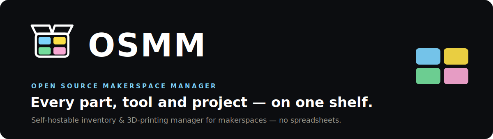

<p align="center">
  
</p>

# OSMM — Open Systems Makerspace Manager

Self-hostable, multi-tenant makerspace hardware-loan & 3D-print manager.

This project started from inside the TinkerSpace Kochi community.

As an active community member, I wanted to figure out a common, practical way to manage two things
every busy makerspace eventually struggles with: shared inventory and 3D printing requests. Different
people had different opinions, habits, and priorities, so this is not presented as the only correct
way to run a makerspace. It is simply one working approach I built to solve the problem in our own
methods.

The idea is simple: make it easier for a community to know what tools exist, who borrowed what, what
is available, and how 3D printing work moves from request to completion.

This repo is open for people to explore in a fun way. Read through it, break it locally, add ideas,
improve flows, remix the features, or use it as a starting point for your own space. If your
community works differently, fork it, edit it, and host your own version.

A multi-tenant **inventory and 3D printing manager for makerspaces**. The public can browse a makerspace's inventory, request to borrow tools, and use QR-based self-checkout when a space enables it. Staff can manage hardware, direct handouts, returns, 3D printing work, evidence, QR scans, remarks, and audit logs so accountability stays clear.

One deployment can host many makerspaces (tenants). Each owns its inventory, public URL,
staff, Telegram group, QR namespace, and audit scope.

- **Public** -> React catalog: pick a makerspace, browse by category, request hardware, or
  self-checkout eligible tools with Check-In verification and uploaded issue/return photos. No platform login.
- **Super Admin** → the **React staff console** at `/admin` is for day-to-day work. The
  **Django control plane** at `/control/` is an operator-only backend surface.
- **All other staff** → the **React staff console** (JWT login). They have **no Django admin access**.

---

## Quick start (run it)

OSMM runs entirely through Docker Compose — it brings up **PostgreSQL, Redis, MinIO storage, the
Celery worker/beat, and database migrations** and networks them to the app for you (the images don't
bake in any of those addresses; the compose file passes them in). Pick one path:

### Path 1 — Guided setup (easiest — builds from source)

Best for a first install. One script generates all secrets, writes `.env`, builds the images, starts
everything, and creates your first admin + makerspace.

1. Install **[Docker Desktop](https://www.docker.com/products/docker-desktop/)** and get the code:
   ```bash
   git clone https://github.com/OSMM-HQ/OSMM-Makerspace-Manager.git
   cd OSMM-Makerspace-Manager
   ```
2. Run the wizard — when it finishes it prints your URL and login:
   ```bash
   bash setup.sh                                          # macOS / Linux
   powershell -ExecutionPolicy Bypass -File setup.ps1     # Windows
   ```

### Path 2 — Prebuilt images (no local build)

Skip building — pull the two published images and start the stack. After `cp .env.example .env`
(fill in the few values it asks for):
```bash
export MAKERSPACE_IMAGE_TAG=latest        # or pin a version, e.g. 0.2.0
docker compose -f docker-compose.prod.yml up -d
```
This pulls **`ghcr.io/osmm-hq/osmm-backend`** + **`ghcr.io/osmm-hq/osmm-frontend`** and brings up the
full stack (DB, Redis, MinIO, Celery, migrations) automatically. Requires the images to be published
and public (see below).

| I want… | Go to |
|---|---|
| A **plain-language, non-technical** walkthrough | **[docs/setup-for-makerspaces.md](docs/setup-for-makerspaces.md)** |
| **Production** reference (env vars, TLS, upgrades) | **[docs/self-hosting.md](docs/self-hosting.md)** |
| **Advanced** config (Telegram, HMAC, Supabase, cron) | **[.github/ADVANCED.md](.github/ADVANCED.md)** |
| **Develop / contribute** (run from source, tests, releases) | **[.github/DEVELOPMENT.md](.github/DEVELOPMENT.md)** |

## Why this exists

The goal is to make it **easy for makerspaces to log and track their stuff**, and to give the
whole **community transparent access** to what's available to borrow — without spreadsheets or
guesswork. It's built to be run by the community, for the community. If you care
about makerspaces and want to help, **volunteers and contributors are very welcome** — whether
you write code, docs, translations, or just run it at your space and report what's rough. See
[CONTRIBUTING.md](.github/CONTRIBUTING.md).

---

## Roles & permissions

Access is scoped per makerspace and per action. Super Admin is global; every other role is a
per-makerspace membership.

| Role | Works in | Can do | Cannot do |
|---|---|---|---|
| **Super Admin** | React staff console; operator-only Django control plane | Everything, globally: create/manage makerspaces, all hardware/printing/ops actions, staff, settings, API clients, audit | — |
| **Space Manager** | React staff console | Full hardware lifecycle for their space (accept/reject, assign box, issue, return, evidence, QR), direct handouts, manage inventory & staff & settings | Other makerspaces; Django admin |
| **Inventory Manager** | React staff console | Full hardware lifecycle + inventory edit + QR + evidence + audit for their space | Printing, staff, makerspace settings; Django admin |
| **Guest Admin** | React staff console | Issue accepted requests + process returns (evidence/QR/remark/audit) | Accept/reject, edit inventory, manage QR, direct handouts; Django admin |
| **Print Manager** | React staff console | 3D-printing request lifecycle (accept/start/complete/fail), printers & spools | Hardware lifecycle, inventory, staff; Django admin |
| **Public** | React catalog | Browse public inventory, submit borrow requests, self-checkout/return eligible QR tools with Check-In verification, uploaded issue/return photo evidence, and return remarks | Anything authenticated |

> **These roles are defined by the system, not by any user.** A Space Manager (or anyone else)
> cannot invent new roles or grant themselves extra powers — they can only assign people to the
> existing roles within their own makerspace. What each role can and cannot do is fixed in the
> platform's permission rules, which keeps every makerspace consistent and accountable.

Two architectural rules are load-bearing:

1. **The Request Workflow module is the single source of truth for state transitions.** The web
   admin, the React console, and Telegram callbacks all route through the same workflow services —
   no module mutates `HardwareRequest.status` directly.
2. **The Inventory Availability module owns all quantity math.** Reserve / issue / return /
   mark-lost all flow through it; availability never goes below zero.

Operational evidence rules are also enforced in the workflows:

- Reviewed hardware requests cannot be issued without a box QR scan and issue photo.
- Reviewed returns cannot be processed without a return photo and return remark.
- Public self-checkout and staff direct handouts require issue evidence; their returns require
  return evidence plus notes before stock moves back.
- QR scanner actions are advisory only: the backend advertises checkout/direct actions only when
  the matching workflow can actually accept the scanned box, product, or asset.

**Stack:** Django 6 + DRF backend · React 19 + Vite 8 + Tailwind CSS 4 + TypeScript frontend
(TanStack Query v5) · PostgreSQL 16 · Celery + Redis async email · django-unfold admin ·
drf-spectacular / OpenAPI.

**Toolchain prerequisites (local, non-Docker dev):** Python 3.12+ and Node 20.19+ (or 22.12+, for
Vite 8). The Docker path bundles everything, so these only matter if you run the backend/frontend
directly.

---

## Hosting

**The primary objective is to self-host inside the makerspace, on a local server.** Your data,
your network, no third party. If a makerspace has no local server to run Postgres, use a managed
Postgres (Supabase) instead and host the app anywhere.

### Option A — Self-host locally (recommended)

The fastest path is the **[Quick start](#quick-start-run-it)** above — the setup wizard, or the
prebuilt images via `docker-compose.prod.yml`. A few extra details:

**Build from source** instead of pulling images:

```bash
docker compose -f docker-compose.prod.yml -f docker-compose.build.yml up -d --build
```

**How images map to services (the "routing" is in the compose file, not the images):** the Celery
`worker`, `beat`, and one-shot `migrate` services all **reuse the backend image** (same image, just
a different start command); Postgres, Redis, and MinIO come from their official public images. So
OSMM ships just **two** images — `osmm-backend` and `osmm-frontend` — and `docker-compose.prod.yml`
provides all the wiring (database URL, Redis, MinIO, network) between them and the datastores.

**Image tags:** `:latest` and pinned `:X.Y.Z` / `:X.Y` are published when the root `VERSION` file is
bumped on `main`; rolling `:edge` and `:sha-<commit>` are published on every push to `main`. Pin
`MAKERSPACE_IMAGE_TAG` in production.

| Surface | URL |
|---|---|
| Public frontend | `http://localhost` |
| React staff console | `http://localhost/admin` |
| API (via frontend proxy) | `http://localhost/api` |
| API (direct container) | `http://localhost:8001/api` |
| Django control plane (superadmin) | `/control/` on the backend only. It is **not exposed** on the public frontend port. Dev: `http://localhost:8001/control/`; production: the backend port is not published, so publish it to localhost temporarily, use a tunnel, or use `docker compose exec backend`. |

Seed demo data and create the first superadmin / makerspace:

```bash
docker compose exec backend python manage.py seed_demo
# or, for a real instance:
docker compose exec backend python manage.py setup_instance
```

`setup_instance` creates the first super admin. With no arguments it uses the
default credentials **`superadmin` / `super123`** and flags the account so the
password **must be changed on first login** (the staff console blocks everything
until you set a new one). Override the defaults non-interactively with
`--username` / `--password` (or the `SETUP_SUPERADMIN_USERNAME` /
`SETUP_SUPERADMIN_PASSWORD` env vars); when you supply an explicit password the
forced-change flag is **not** set.

```bash
# explicit, no forced change:
docker compose exec backend python manage.py setup_instance \
  --username admin --password "$(openssl rand -base64 18)"
```

For production from published images (env vars, TLS, reverse proxy), see
**[docs/self-hosting.md](docs/self-hosting.md)**.

Set `ENABLE_HTTPS=true` only when a reverse proxy terminates real TLS and forwards
`X-Forwarded-Proto: https`; otherwise the default HTTP-behind-nginx setup is correct.

### Option B — No local server? Partner with another makerspace first

This app is **multi-tenant**: one backend can host many makerspaces, each with its own public URL,
branding, and frontend. So if you don't have a server, **reach out to a nearby makerspace that
does** — they can host your makerspace as an additional tenant on their instance. Most makers are
happy to help a fellow space, and it's a natural way for them to contribute to the project. You get
your own catalog and admin; they run one shared backend.

### Option C — Still not possible? Supabase Postgres

The backend is plain Django + Postgres, so any managed Postgres works. Point `DATABASE_URL` at a
Supabase connection string and host the app on any platform.

1. Create a Supabase project → **Project Settings → Database** → copy the connection string
   (prefer the **pooled** string if your host has connection limits).
2. Replace the password placeholder and append `?sslmode=require` if not already present.
3. Set `DATABASE_URL` in the backend environment and run migrations:

```bash
cd backend && python manage.py migrate
```

```env
DATABASE_URL=postgres://postgres.<project-ref>:<password>@aws-0-<region>.pooler.supabase.com:6543/postgres?sslmode=require
```

If you later adopt Supabase Auth/Storage, keep `SUPABASE_SERVICE_ROLE_KEY` on the **backend only** —
never expose it to the frontend.

#### Managed-Postgres mode (env-toggled — full Supabase free-tier setup)

The backend has a **managed mode** for Supabase (Postgres **+** Storage), switched entirely by
env vars that all default to the self-hosted behavior — so the bundled Docker stack is unchanged
unless you set them. The full runbook (bucket/CORS, pooler, cron, email, caps, limitations) is in
**[docs/supabase-deployment.md](docs/supabase-deployment.md)**. The toggles:

| Variable | Default (self-hosted) | Supabase |
|----------|----------------------|----------|
| `MANAGED_POSTGRES` | `False` | `True` |
| `STORAGE_PRESIGN_METHOD` | `post` (MinIO/S3) | `put` (Supabase Storage) |
| `CONN_MAX_AGE` | `0` | `0` on the transaction pooler |
| `DISABLE_SERVER_SIDE_CURSORS` | `False` | `True` on the transaction pooler |
| `CRON_SECRET` | `""` (reminder endpoint disabled) | a long random secret |

Two things to know going in: Supabase **can't host Django** (run it on Render / PythonAnywhere /
similar — Supabase is DB + Storage only), and a 100%-free deployment is realistic as a **demo /
small pilot**, not dependable production (`docs/performance-and-supabase-report.md`). Run
`manage.py migrate` against the **direct/session-pooler** URL (the transaction pooler can't run
the prepared statements migrations need), then point the app at the transaction pooler.

> **Why `MANAGED_POSTGRES`?** Superadmin makerspace **purge** must briefly suspend the
> append-only/immutability triggers to hard-delete a tenant's graph. Self-hosted Postgres does
> this with `SET LOCAL session_replication_role='replica'` (needs DB superuser). Supabase never
> grants superuser, so managed mode instead sets a transaction-scoped custom GUC
> (`app.allow_immutable_delete`) that those triggers honor **for DELETE only** (UPDATE stays
> blocked; FK triggers stay enabled and Django deletes the graph in dependency order). Both are
> transaction-scoped and auto-reset on commit/rollback — a crash mid-purge can never leave the
> immutability triggers durably disabled.

---

## Development & advanced configuration

Running OSMM **from source**, the test suite, and how releases are cut live in
**[.github/DEVELOPMENT.md](.github/DEVELOPMENT.md)**.

**Optional/advanced operator config** — Telegram alerts, server-to-server HMAC clients, security
hardening, managed-Postgres/Supabase mode, and scheduled return reminders — lives in
**[.github/ADVANCED.md](.github/ADVANCED.md)**. The full environment reference is in
**[docs/self-hosting.md](docs/self-hosting.md)**.

---

## Contributing

Contributions are welcome — OSMM is a collaborative project for the makerspace community. See
**[CONTRIBUTING.md](.github/CONTRIBUTING.md)** (pull requests require signing the
**[CLA](.github/CLA.md)**).

---

## License

OSMM is **source-available**, not OSI "open source" — it is free for noncommercial use, and
commercial rights are reserved to OSMM-HQ.

- **Governing license:** [PolyForm Noncommercial License 1.0.0](LICENSE.md)
  (`SPDX-License-Identifier: PolyForm-Noncommercial-1.0.0`).
- **Free, no approval needed** — see [LICENSE-EXCEPTIONS.md](LICENSE-EXCEPTIONS.md):
  - **Any makerspace** may self-host OSMM to run its **own** space — including for-profit /
    membership-funded makerspaces.
  - **Nonprofits**, schools, clubs, and individuals may use OSMM for their internal purposes.
  - Anyone may fork, study, and modify OSMM for noncommercial use.
- **Reserved to OSMM-HQ (needs a commercial license)** — see [COMMERCIAL-LICENSE.md](COMMERCIAL-LICENSE.md):
  reselling OSMM, hosting it as a paid service for others, or bundling it into a commercial product.

To request a commercial license, contact the **OSMM-HQ** organization via
[github.com/OSMM-HQ](https://github.com/OSMM-HQ).
